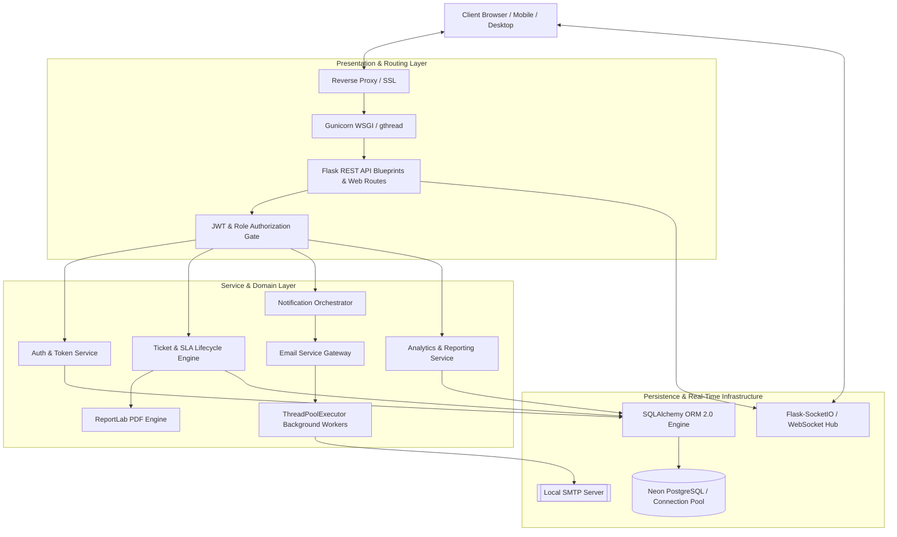

# <div align="center">🎟️ Ticket-Tally</div>

<div align="center">
  <h3><strong>Enterprise IT Service Management & Real-Time Incident Orchestration</strong></h3>
  <p><em>A production-hardened, high-performance ITSM platform built with Python, Flask, SQLAlchemy, Neon PostgreSQL, and real-time WebSockets.</em></p>

  <p>
    <a href="https://ticket-tally.onrender.com" target="_blank">
      
    </a>
    
    
    
    
    
  </p>
</div>

---

## 📑 Table of Contents

- [Executive Summary](#-executive-summary)
- [System Architecture](#-system-architecture)
- [Role-Based Access & Domain Workflows](#-role-based-access--domain-workflows)
- [⚡ Performance Engineering & N+1 Query Elimination](#-performance-engineering--n1-query-elimination)
- [🛡️ Production Hardening Journey](#️-production-hardening-journey)
- [🔐 Security & Authentication Architecture](#-security--authentication-architecture)
- [📬 Dual-Mode Notification & PDF Pipeline](#-dual-mode-notification--pdf-pipeline)
- [🧪 Automated Test Suite & Quality Assurance](#-automated-test-suite--quality-assurance)
- [📂 Project Directory Architecture](#-project-directory-architecture)
- [⚙️ Local Quickstart & Development Setup](#️-local-quickstart--development-setup)
- [☁️ Cloud Deployment Configuration](#️-cloud-deployment-configuration)
- [📚 OpenAPI / Swagger API Reference](#-openapi--swagger-api-reference)
- [📄 License](#-license)

---

## 🚀 Executive Summary

**Ticket-Tally** is an enterprise-grade IT Service Management (ITSM) web application designed to bridge technical support operations and organizational users. Engineered for scalability, reliability, and sub-50ms data queries, Ticket-Tally replaces fragmented ticket tracking with a data-driven incident orchestration platform.

### Core Capabilities
- **Multi-Tenant Role Control:** Independent, strict interfaces and authorization barriers for **Employees** (Requesters), **IT Staff** (Resolvers), and **System Administrators** (Governance).
- **Automated SLA Engine:** Real-time SLA breach countdowns, priority tier mapping (Critical, High, Medium, Low), automated ticket aging transitions, and customer satisfaction (CSAT) scoring.
- **Dynamic PDF Reporting:** Asynchronous binary PDF generation for incident resolution summaries and administrative analytics export via ReportLab.
- **Resilient Real-Time Sync:** Bi-directional status synchronization, live activity feeds, and unread badge counters powered by Flask-SocketIO.
- **Universal Responsive Design:** Pixel-perfect fluid layout verified across viewports from **320px mobile displays to 1440px+ widescreen monitors**.

---

## 🏗️ System Architecture

Ticket-Tally follows a decoupled, layered architectural pattern ensuring strict separation of concerns across presentation, routing, domain services, and persistence:



---

## 👥 Role-Based Access & Domain Workflows

Ticket-Tally enforces strict Role-Based Access Control (RBAC) across three distinct organizational personas:

```
┌─────────────────────────────────────────────────────────────────────────────┐
│                             ORGANIZATIONAL ROLES                            │
├───────────────────────┬────────────────────────────┬────────────────────────┤
│   👤 EMPLOYEE         │   🛠️ IT STAFF               │   👑 ADMINISTRATOR     │
│   (Request Tier)      │   (Resolution Tier)        │   (Governance Tier)    │
├───────────────────────┼────────────────────────────┼────────────────────────┤
│ • Submit incidents    │ • Claim ticket queue       │ • System-wide metrics  │
│ • Real-time tracking  │ • Status lifecycle updates │ • User & team mappings │
│ • Interactive history │ • Internal tech comments   │ • SLA policy rules     │
│ • CSAT rating reviews │ • SLA breach monitoring    │ • PDF report exports   │
│ • In-app notifications│ • Direct PDF generation    │ • Security audits      │
└───────────────────────┴────────────────────────────┴────────────────────────┘
```

### Incident Lifecycle State Machine
```
[SUBMITTED] ──► [OPEN] ──► [IN PROGRESS] ──► [RESOLVED] ──► [CLOSED]
                  │               │               │
                  └── Claim       └── Reassign    └── CSAT / Reopen Request
```

---

## ⚡ Performance Engineering & N+1 Query Elimination

During performance profiling of large datasets, the application underwent a major query optimization campaign to eliminate N+1 query bottlenecks and stabilize database connection pools.

### Database Query Optimization Benchmark

| Endpoint / Operation | Initial Query Count | Optimized Query Count | Query Reduction |
| :--- | :---: | :---: | :---: |
| **Ticket Listing (`GET /api/v1/tickets?per_page=50`)** | `254 queries` | **`5 queries`** | **98.0% ↓** |
| **Admin Dashboard (`GET /api/v1/analytics/dashboard`)** | `166 queries` | **`13 queries`** | **92.2% ↓** |
| **IT Staff Dashboard (`GET /api/v1/analytics/it-dashboard`)** | `118 queries` | **`8 queries`** | **93.2% ↓** |
| **Dashboard Report Export (`GET /api/v1/admin/export-dashboard-report`)** | `89 queries` | **`4 queries`** | **95.5% ↓** |

```
Query Reduction Showcase:
Initial (254 Queries):  ████████████████████████████████████████ 100%
Optimized (5 Queries):  █ 2% (98% Reduction)
```

### Engineering Solutions Applied:
1. **Eager Relationship Loading:** Replaced implicit lazy queries on foreign keys (`creator`, `assignee`, `team`, `comments`) with explicit SQLAlchemy `joinedload()` and `selectinload()` strategies.
2. **PostgreSQL Composite Indexing:** Added composite indexes across `(is_deleted, created_at)`, `(assigned_to_id, status)`, `(created_by_id, status)`, and `(email)`.
3. **Neon Cloud Connection Recycling:** Configured `pool_recycle: 280` and `pool_pre_ping: True` in `SQLALCHEMY_ENGINE_OPTIONS`, preventing socket termination during Neon's 300s serverless idle timeout.
4. **Asynchronous PDF Offloading:** Dispatched heavy ReportLab PDF rendering to dedicated background thread workers (`ThreadPoolExecutor`), eliminating HTTP request blocking.

---

## 🛡️ Production Hardening Journey

Ticket-Tally was subjected to a comprehensive stabilization and hostile QA audit program. Every identified defect was remediated with isolated, regression-tested patches:

```
┌──────────────────────────────────────────────────────────────────────────────────────────────────────────┐
│                                   PRODUCTION STABILIZATION TIMELINE                                      │
├──────────────┬───────────────────────────────────────────┬───────────────────────────────────────────────┤
│ Issue ID     │ Description & Root Cause                  │ Engineering Remediation                      │
├──────────────┼───────────────────────────────────────────┼───────────────────────────────────────────────┤
│ **P0-1**     │ Invisible mobile hamburger toggle button  │ Added high-contrast `#111827`/`#f1f5f9` SVG   │
│ **P0-2**     │ Password reset email delivery exception   │ Added case normalization & direct recipient   │
│ **P0-3**     │ Password reset production URL resolution  │ Dynamic host/scheme resolution over proxies   │
│ **ISSUE-04** │ Landing page horizontal scrollbar (320px) │ Corrected `ms-lg-*` margin & grid minmax CSS  │
│ **ISSUE-05** │ Calendar toolbar overflow on mobile       │ Responsive FullCalendar flex-column stacking  │
│ **ISSUE-06** │ Floating hero cards clipping on tablets   │ Synchronized `.hero-visual` breakpoint to 991px│
│ **ISSUE-07** │ Demo Mode exit button header wrapping     │ Added compact accessible 36px icon on mobile  │
│ **ISSUE-08** │ Password reset 429 rate-limit user UX     │ Explicit 429 handler + amber warning toast    │
│ **ISSUE-09** │ Dark mode initial render flash (FOUC)     │ Immediate synchronous script parse execution  │
│ **ISSUE-10** │ Toast notification screen-reader a11y     │ Dynamic `role="status"` / `aria-live="polite"`│
│ **P0-CSS**   │ Ticket Details raw CSS text rendering     │ Eliminated premature `</style>` tag at line 149│
└──────────────┴───────────────────────────────────────────┴───────────────────────────────────────────────┘
```

---

## 🔐 Security & Authentication Architecture

Ticket-Tally adheres to modern web security practices:

- **JWT Authentication:** Stateless, signed JSON Web Tokens stored securely in client session storage with automated expiry enforcement.
- **Salted Password Hashing:** User passwords securely hashed using salted key derivation algorithms via Werkzeug security.
- **Anti-Enumeration Protection:** Password reset and login endpoints return uniform, non-distinguishing responses, preventing attackers from probing for registered user accounts.
- **SQL Injection Immunity:** 100% of database interactions execute through parameterized SQLAlchemy ORM queries.
- **Rate Limiting:** Granular rate limiting on sensitive routes (e.g., `@limiter.limit("3 per minute")` on password resets) via Flask-Limiter.
- **XSS & CSRF Defense:** Automatic Jinja2 HTML escaping and strict CORS origin validation.

---

## 📬 Dual-Mode Notification & PDF Pipeline

To deliver reliable communication without forcing costly third-party infrastructure, Ticket-Tally implements an **Environment-Based Dual Email Availability Mode**:

```
[SYSTEM NOTIFICATION EVENT]
            │
            ├──► 💾 In-App Notification (Committed to Database — Source of Truth)
            │
            └──► 📧 Email Delivery Gate
                      │
                      ├──► [EMAIL_DELIVERY_ENABLED=true (Local Development)]
                      │         │
                      │         └──► smtplib.SMTP ──► Real Inbox Delivery
                      │
                      └──► [EMAIL_DELIVERY_ENABLED=false (Cloud Production / Render Free)]
                                │
                                └──► Skip SMTP ──► Badge: "In-App Notifications Only"
```

- **Online/Offline Decoupling:** In-app notifications are persisted to the database independently of email dispatches. When offline users log in, unread notification counts and updates are immediately accessible.
- **Binary PDF Generation:** Automated ReportLab document builder creates downloadable, formatted PDF resolution summaries with ticket metadata, technician notes, and audit history.

---

## 🧪 Automated Test Suite & Quality Assurance

Ticket-Tally features an automated Pytest test suite covering unit tests, API integration tests, database constraints, concurrency limits, and regression assertions:

```text
============================= test session starts =============================
platform win32 -- Python 3.14.2, pytest-9.0.2, pluggy-1.6.0
collected 88 items

tests\test_agent_directory.py .......                                    [  7%]
tests\test_announcements.py ....                                         [ 12%]
tests\test_auth.py .........                                             [ 22%]
tests\test_casing_standardization.py ......                              [ 29%]
tests\test_csat.py .....                                                 [ 35%]
tests\test_dashboard_report_export.py ..                                 [ 37%]
tests\test_data_retention.py ...                                         [ 40%]
tests\test_events.py ........                                            [ 50%]
tests\test_github_integration.py ...                                     [ 53%]
tests\test_performance_export.py ..                                      [ 55%]
tests\test_phase1_remediation.py ..............                          [ 71%]
tests\test_project_restriction.py .                                      [ 72%]
tests\test_rate_limiting.py ..                                           [ 75%]
tests\test_reopen_requests.py ..                                         [ 77%]
tests\test_sla.py ........                                               [ 86%]
tests\test_team_assignment.py .                                          [ 87%]
tests\test_team_mapping.py ......                                        [ 94%]
tests\test_ticket_ageing_rules.py .....                                  [100%]

======================= 88 passed, 6 warnings in 62.48s =======================
```

To run the complete test suite locally:
```bash
pytest -v
```

---

## 📂 Project Directory Architecture

```text
Trial_Ticket_Tally_01/
├── app/
│   ├── api/
│   │   └── v1/                  # REST API Blueprints
│   │       ├── admin_routes.py         # System metrics, user management, team mappings
│   │       ├── analytics_routes.py     # High-performance analytics & chart metrics
│   │       ├── announcement_routes.py  # System broadcast announcements
│   │       ├── auth_routes.py          # Signup, Login, Password Reset, Config
│   │       ├── it_staff_routes.py      # Ticket claim, assign, status lifecycle
│   │       ├── notification_routes.py  # In-app notification management
│   │       ├── project_routes.py       # Project CRUD & team assignments
│   │       ├── ticket_routes.py        # Ticket CRUD, comments, ReportLab PDF
│   │       └── user_routes.py          # User profiles & avatar uploads
│   ├── core/                    # Core System Backbone
│   │   ├── config.py                   # Environment configuration & pool recycling
│   │   ├── constants.py                # Enums (UserRole, TicketStatus, SLAStatus)
│   │   ├── database.py                 # SQLAlchemy engine initialization
│   │   └── extensions.py               # SocketIO, Limiter, APScheduler, Migrate
│   ├── middleware/              # Authentication & Role Authorization
│   │   └── auth_middleware.py          # JWT Bearer token & RBAC validation
│   ├── models/                  # Persistent SQLAlchemy ORM Models
│   │   ├── comment.py, message.py, notification.py, project.py
│   │   ├── sla.py, team.py, ticket.py, user.py
│   ├── services/                # Business Domain Logic
│   │   ├── auth_service.py             # User registration & password recovery
│   │   ├── email_service.py            # SMTP transport gateway & delivery gate
│   │   ├── email_templates.py          # Responsive HTML email templates
│   │   ├── notification_service.py     # In-app notification orchestrator
│   │   ├── pdf_service.py              # ReportLab binary PDF generator
│   │   └── ticket_service.py           # SLA calculation & ticket lifecycle
│   ├── static/                  # Client-Side Assets
│   │   ├── css/                        # Custom design tokens, landing.css, fixes.css
│   │   └── js/                         # theme.js (0ms FOUC), auth.js, socket clients
│   ├── templates/               # Responsive Jinja2 HTML Templates
│   ├── utils/                   # Shared Helper Utilities
│   │   ├── jwt.py, password.py, token.py, time_utils.py
│   └── websocket/               # Real-Time WebSocket Event Handlers
│       └── ticket_socket.py
├── migrations/                  # Alembic Database Migration History
├── tests/                       # Automated Pytest Test Suite (88 Tests)
├── render.yaml                  # Render Cloud Deployment Blueprint
├── requirements.txt             # Python Package Dependencies
└── run.py                       # Application Entrypoint
```

---

## ⚙️ Local Quickstart & Development Setup

### 1. Prerequisites
- Python `3.11+`
- PostgreSQL or SQLite
- Git

### 2. Clone the Repository
```bash
git clone https://github.com/Tanish1808/Trial_Ticket_Tally.git
cd Trial_Ticket_Tally
```

### 3. Create and Activate a Virtual Environment
```bash
# Windows
python -m venv venv
.\venv\Scripts\Activate.ps1

# Linux / macOS
python3 -m venv venv
source venv/bin/activate
```

### 4. Install Dependencies
```bash
pip install --upgrade pip
pip install -r requirements.txt
```

### 5. Configure Environment Variables
Create a `.env` file in the project root:
```env
FLASK_ENV=development
SECRET_KEY=your-secure-secret-key
JWT_SECRET_KEY=your-secure-jwt-key
DATABASE_URL=sqlite:///ticket_tally.db

# Email Configuration (Local SMTP)
EMAIL_DELIVERY_ENABLED=true
MAIL_SERVER=smtp.gmail.com
MAIL_PORT=587
MAIL_USE_TLS=True
MAIL_USERNAME=your-email@gmail.com
MAIL_PASSWORD=your-google-app-password

BASE_URL=http://localhost:5000
```

### 6. Initialize Database Migrations
```bash
flask db upgrade
```

### 7. Run the Application
```bash
python run.py
```
Open your browser at `http://localhost:5000`.

---

## ☁️ Cloud Deployment Configuration

Ticket-Tally includes a production blueprint for zero-downtime deployment on **Render** paired with serverless **Neon PostgreSQL**:

### `render.yaml` Configuration
```yaml
services:
  - type: web
    name: ticket-tally
    runtime: python
    buildCommand: pip install --upgrade pip && pip install -r requirements.txt
    preDeployCommand: flask db upgrade
    startCommand: gunicorn --worker-class gthread --workers=1 --threads=4 --bind 0.0.0.0:$PORT run:app
    envVars:
      - key: PYTHON_VERSION
        value: 3.12.0
      - key: FLASK_APP
        value: app.main:create_app
      - key: FLASK_ENV
        value: production
      - key: DATABASE_URL
        sync: false
      - key: EMAIL_DELIVERY_ENABLED
        value: "false"
      - key: JSON_LOGGING
        value: "True"
```

---

## 📚 OpenAPI / Swagger API Reference

Ticket-Tally features an interactive, auto-generated OpenAPI / Swagger 2.0 interface.

When the application is running, navigate to:
```
http://localhost:5000/api/docs
```

### Key API Endpoints

| Method | Endpoint | Description | Authorization |
| :--- | :--- | :--- | :--- |
| `POST` | `/api/v1/auth/login` | Authenticate user & receive JWT token | Public |
| `POST` | `/api/v1/auth/forgot-password` | Request password reset token | Public (Rate-limited) |
| `GET` | `/api/v1/auth/config` | Query runtime client configuration | Public |
| `GET` | `/api/v1/tickets` | List tickets (Paginated, Eager-loaded) | Authenticated |
| `POST` | `/api/v1/tickets` | Submit new incident ticket | Authenticated |
| `GET` | `/api/v1/tickets/{id}/pdf` | Download ReportLab resolution PDF | Requester / Staff / Admin |
| `PATCH`| `/api/v1/it-staff/tickets/{id}/status` | Transition ticket lifecycle status | IT Staff / Admin |
| `GET` | `/api/v1/analytics/dashboard` | High-performance dashboard analytics | Admin |
| `GET` | `/api/v1/admin/export-dashboard-report` | Stream administrative metrics PDF | Admin |

---

## 📄 License

This project is open-source software licensed under the **[MIT License](LICENSE)**.
